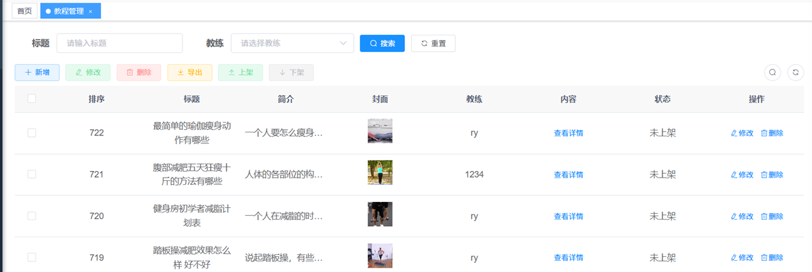
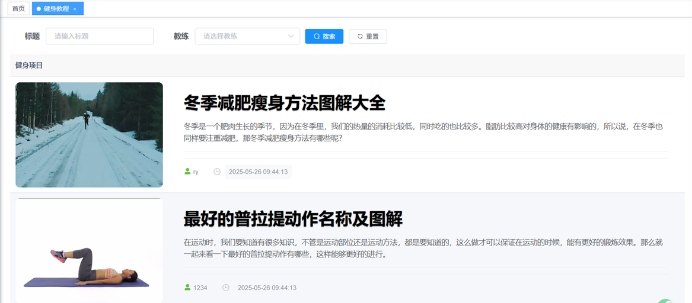
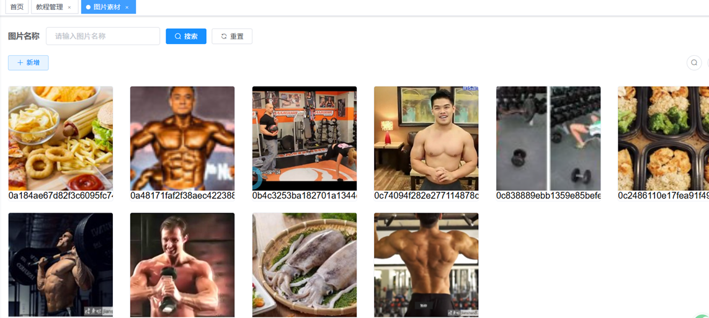
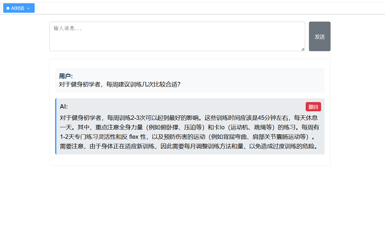
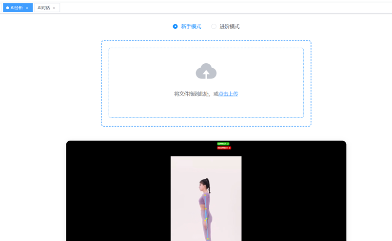

## 智能健身教练平台
基于ruoyi-vue（升级为SpringBoot3，前端Vue2）框架开发的智能健身教练平台。包含健身教程编写上传管理、素材库开发、AI对话、AI分析等功能。

#### 下载启动教程（Windows端）

#####1.后端

git clone本项目，运行Redis ，运行sql文件夹中的文件，在配置项目文件中更改Redis以及Mysql的相关数据适配本机。IDE打开项目利用Maven安装相关依赖即可启动。

##### 2.前端

利用IDE打开Ruoyi-ui文件夹使用npm下载相关依赖并启动。

##### 3.AI对话

项目使用Spring AI+Ollama实现AI对话，下载Ollama并启动，项目默认使用deepseek-r1:1.5b模型，利用Ollama下载该模型即可。可更改模型注意更改后端配置文件中的模型信息。此外项目可支持使用Docker+Dify实现右下角AI助手，可参考[Dify嵌入若依系统充当智能助手（手把手教）](https://mp.weixin.qq.com/s/JHbKsheQ7uvYcI6fqM3xow)教程实现（项目包含前端代码注意更改相关配置）。

##### 4.AI分析

AI分析功能基于[AI-Fitness-Trainer-Squats-Analysis](https://github.com/Tanwar-12/AI-Fitness-Trainer-Using-MediaPipe-Squats-Analysis/assets/110081008/0a09539e-9183-4f33-95d6-db99a898c92b)项目，使用Flask进行封装，打开该文件夹安装并激活Flask运行所需要的虚拟环境安装equirements.txt中所需依赖。激活虚拟环境后输入

```
flask run
```

启动服务。

！！！注意使用IDE进入\shared_storage文件夹中利用npm下载http-server依赖输入：

```
http-server -p 82 --cors
```

上传视频分析服务才能使用。

##### 注意事项

上传视频进行分析部分使用了绝对路径请更改路径名。若出现AI功能服务未能使用请先检查端口配置。

开发人员：Bruce Huang/Lee

联系方式：

WeChat：hs1848094556（WeChat number）

Email：hs184809455@163.com

##### 特别感谢

感谢Ruoyi-Vue开源框架及提供的文档服务，感谢[AI-Fitness-Trainer-Squats-Analysis](https://github.com/Tanwar-12/AI-Fitness-Trainer-Using-MediaPipe-Squats-Analysis/assets/110081008/0a09539e-9183-4f33-95d6-db99a898c92b)项目AI分析功能提供的支持。

#### 功能预览：

##### 教程管理



##### 教程界面



##### 图片素材库



##### AI对话：



##### AI分析

