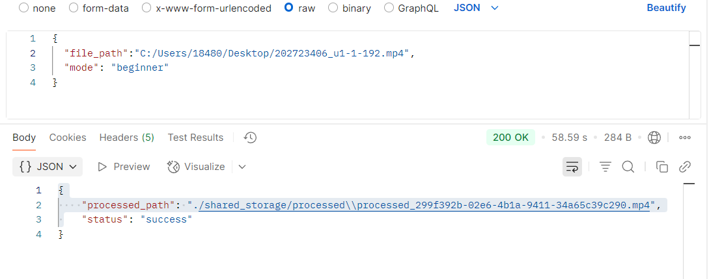
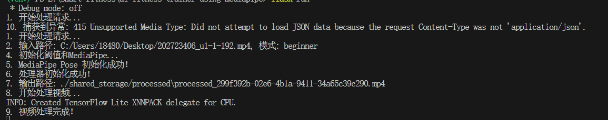

###AI识别

系统架构：

```
前端(Vue) 
  → 
Spring Boot (文件上传/API网关) 
  → 
Flask AI服务 (视频处理) 
  → 
数据库(MySQL)
```

数据库

```sql
CREATE TABLE ai_video_analy (
    id bigint PRIMARY KEY AUTO_INCREMENT,
    original_path VARCHAR(500) NOT NULL,
    processed_path VARCHAR(500),
    user_id bigint,
    mode ENUM('BEGINNER', 'PRO') NOT NULL,
    status ENUM('PENDING', 'PROCESSING', 'COMPLETED', 'FAILED') DEFAULT 'PENDING',
    created_at datetime DEFAULT CURRENT_TIMESTAMP,
    analysis_result TEXT
);
```

### python flask使用

创建虚拟环境

```
python -m venv venv
```

进入虚拟环境

```
cd 'venv/Scripts'
```

激活虚拟环境

```
./activate
```

安装所需要的包

```
flask opencv-python mediapipe uuid...
```

运行

```
flask run
```

利用postman模拟请求



运行成功



http-server -p 82 --cors