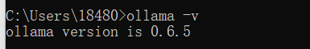

### LLM对话实现

##### 本地部署Ollama

Ollama是一个大模型部署工具，进入官网可以直接安装，安装完成后启动cmd输入ollama –v输出版本后代表安装完成。



根据实际需求与硬件配置故选择使用qwen:0.5b模型，输入ollama run qwen:0.5b后等待安装下载出现以下界面代表安装完成。


添加依赖与配置信息：

```
<dependency>
            <groupId>org.springframework.ai</groupId>
            <artifactId>spring-ai-ollama-spring-boot-starter</artifactId>
            <version>0.8.1</version>
        </dependency>
        
```

```
ai:
  ollama:
     base-url: http://localhost:11434
     chat:
        options:
          model: qwen:0.5b
```

创建测试服务，利用postman模拟测试。

OllamaChatClient允许用户调用其api并响应返回内容

```
@RestController
public class OllamaChatController {
 
    @Resource
    private OllamaChatClient ollamaChatClient;
    @GetMapping("/ollama/chat")
    public String ollamaChat(@RequestParam String msg){
        String resMsg = ollamaChatClient.call(msg);
        return resMsg;
    }
 
}
```

前端消息发送：

```
async handleSubmit() {
  // 验证输入有效性
  if (!this.userMsg.trim()) return;

  try {
    this.isSending = true;

    // 1. 构建用户消息对象
    const userMessage = {
      type: 'user',
      content: this.userMsg,
      tempId: store.state.user.id, // 关联用户ID
      timestamp: Date.now()
    };
    this.history.push(userMessage);

    // 2. 发送API请求
    const response = await axios.post('/AI/AI-LLM', {
      userMsg: this.userMsg,
      sessionId: this.sessionId
    });

    // 3. 处理响应数据
    if (response.data?.length >= 2) {
      const [metadata, aiResponse] = response.data;
      
      // 4. 构建AI响应消息
      const aiMessage = {
        type: 'ai',
        id: metadata.id, // 服务器生成的唯一ID
        content: aiResponse.content,
        revocable: true, // 可撤回标记
        timestamp: Date.now(),
        relatedUserMsgId: userMessage.tempId // 关联用户消息ID
      };
      
      this.history.push(aiMessage);
    }
  } catch (error) {
    // 错误处理
    this.history.push({
      type: 'system',
      content: `错误: ${error.message}`,
      isError: true
    });
  } finally {
    this.issending = false;
  }
}

```

后端：

```
 @PostMapping("/AI/AI-LLM")
    public ResponseEntity<?> ollamaChat(@RequestBody ChatRequest request) {
        try {
            // 调用大模型获取响应
            String aiContent = ollamaChatClient.call(request.getUserMsg());
            // 构建持久化记录
            AiChatRecord record = new AiChatRecord();
            record.setUserInput(request.getUserMsg());    // 用户输入（对应userInput字段）
            record.setAiResponse(aiContent);             // AI响应（对应aiResponse字段）
            record.setSessionId(request.getSessionId());
            record.setModelName("qwen:0.5b");               // 硬编码模型名称（根据实际情况调整）
            //插入数据库记录（createTime由BaseEntity自动填充）
            aiChatRecordService.insertAiChatRecord(record);


            // 构造返回数据结构
            Map<String, Object> metadata = new HashMap<>();
            metadata.put("id", UUID.randomUUID().toString()); // 生成唯一消息ID
            metadata.put("sessionId", request.getSessionId());

            Map<String, Object> aiResponse = new HashMap<>();
            aiResponse.put("content", aiContent);

            return ResponseEntity.ok(Arrays.asList(metadata, aiResponse));
        } catch (Exception e) {
            return ResponseEntity.internalServerError().body(
                    Collections.singletonMap("error", "AI服务暂时不可用")
            );
        }
    }

    // 请求参数DTO
    static class ChatRequest {
        private String userMsg;
        private String sessionId;

        // 需要getter/setter
        public String getUserMsg() { return userMsg; }
        public void setUserMsg(String userMsg) { this.userMsg = userMsg; }
        public String getSessionId() { return sessionId; }
        public void setSessionId(String sessionId) { this.sessionId = sessionId; }
    }
```

插入数据库：

```
 // 构建持久化记录
            AiChatRecord record = new AiChatRecord();
            record.setUserInput(request.getUserMsg());    // 用户输入（对应userInput字段）
            record.setAiResponse(aiContent);             // AI响应（对应aiResponse字段）
            record.setSessionId(request.getSessionId());
            record.setModelName("qwen:0.5b");               // 硬编码模型名称（根据实际情况调整）
            //插入数据库记录（createTime由BaseEntity自动填充）
            aiChatRecordService.insertAiChatRecord(record);
```

