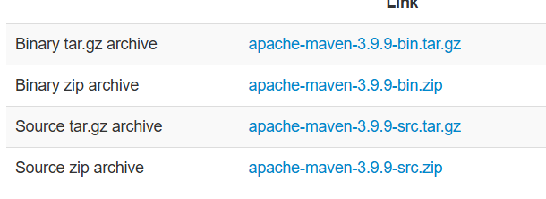
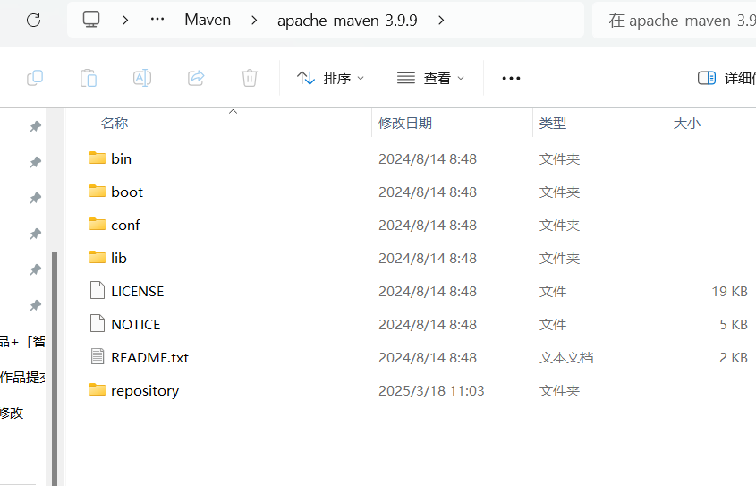
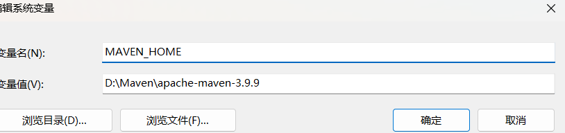
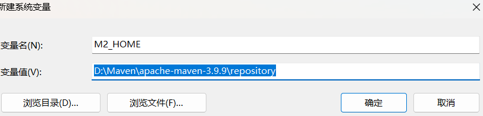
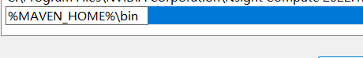

### 升级Spring Boot

####一、升级maven（可选）

选择最新版本3.9.9

下载解压到指定路径，新建repository文件夹

配置系统环境变量

修改setting信息。

参考：[全站最全Maven下载安装配置教学（2024更新...全版本）建议收藏...赠送IDEA配置Maven教程-CSDN博客](https://blog.csdn.net/MSDCP/article/details/127680844)