# 富文本编辑

1.使用若依自带的quill富文本编辑器

文件配置位置在ruoyi-ui/assets/components/Editor/index.vue

2.在数据库中创建表

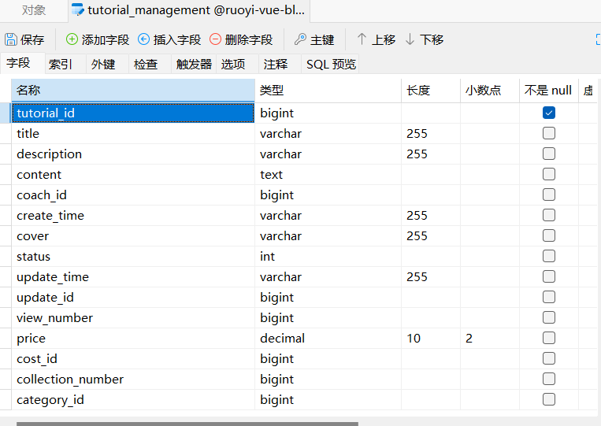

3.使用代码生成功能实现基本的增删改查，主要注意生成信息和字段信息的修改。

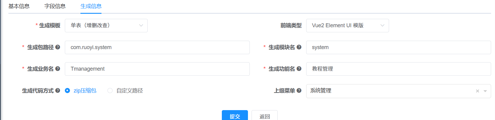

4.将生成的文件复制到前后端对应的文件中。

比如生成模块名填写的是system，就把后端相关文件放入system模块的文件夹下。注意Controller类要单独放在ruoyi-admin也就是启动类所在的模块中。如图：
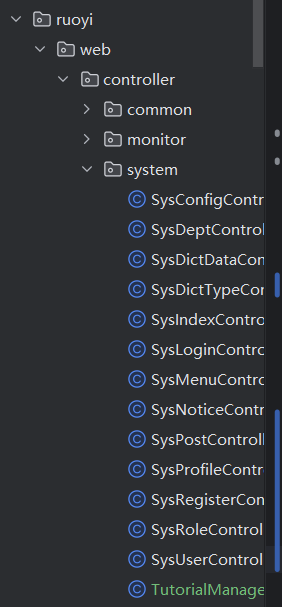

前端文件直接复制在src文件夹下即可。

5.前段报错：JSON parse error: Unexpected character ('/' (code 47)): maybe a (non-standard) comment? (not recognized as one since Feature 'ALLOW_COMMENTS' not enabled for parser)

解决方法：修改后端ApplicationConfig类中关于json配置的代码，启用`ALLOW_COMMENTS` 功能。

6.内容框显示文本过多不美观（前端UI）

解决：为内容列添加 show-overflow-tooltip属性（表格）

7.添加预览按钮（前端UI）

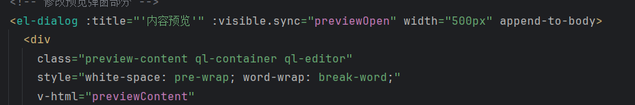

8.图片保存报错JSON parse error: Unexpected character ('>' (code 62)): was expecting either '*' or '/' for a comment;

解决：后端application.yml中关闭xss过滤或者只过滤掉图片上传接口（相当于将图片上传接口加入白名单）。

9.使用若依自带的quill富文本编辑器。在编辑器配置类中修改编辑器配置实现上传本地视频的功能。

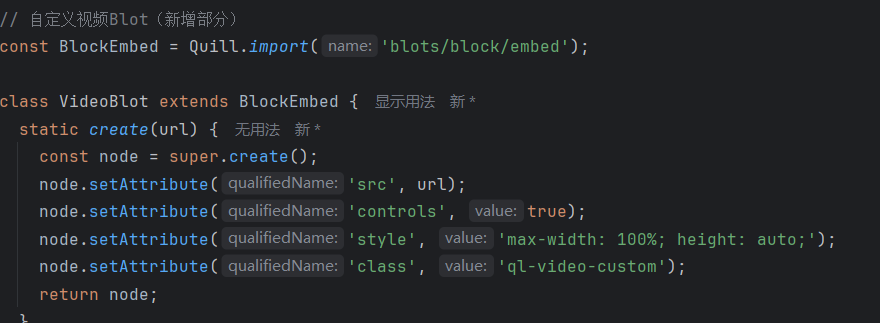

10.在使用若依框架的Quill编辑器时，发现预览界面中的图片显示大小与编辑时不一致。这个问题通常是由于Quill编辑器在保存内容时使用了base64编码的图片，而预览时直接渲染了原始图片尺寸，没有进行自适应处理。

解决：修改前端预览组件代码进行自适应处理。

11.预览界面字体大小与编辑界面不一致，手动修改预览界面大小。如上图

12.文件存储位置由硬编码改为相对位置存储

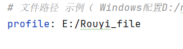

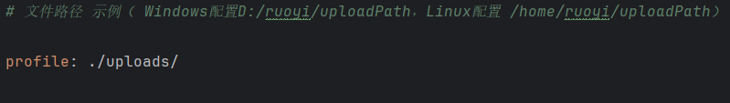

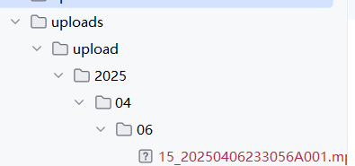

# 新增代码备忘录

后端：
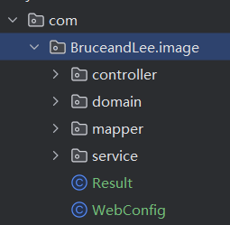

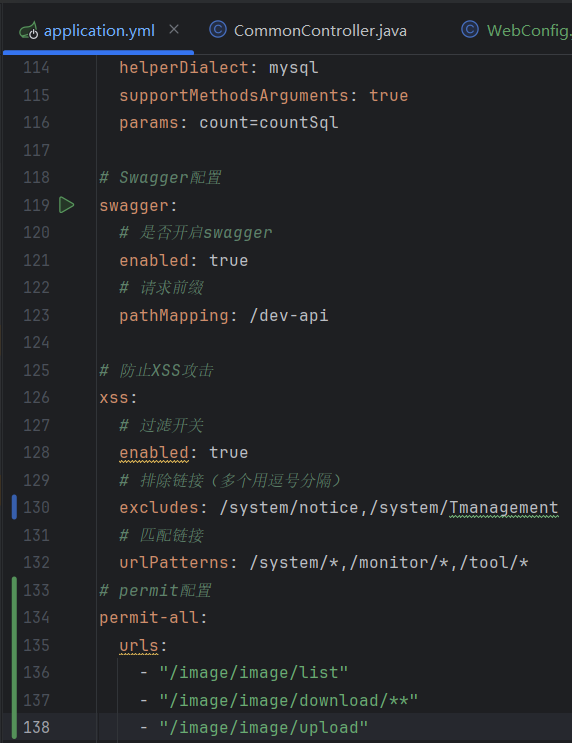

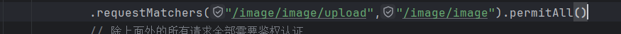

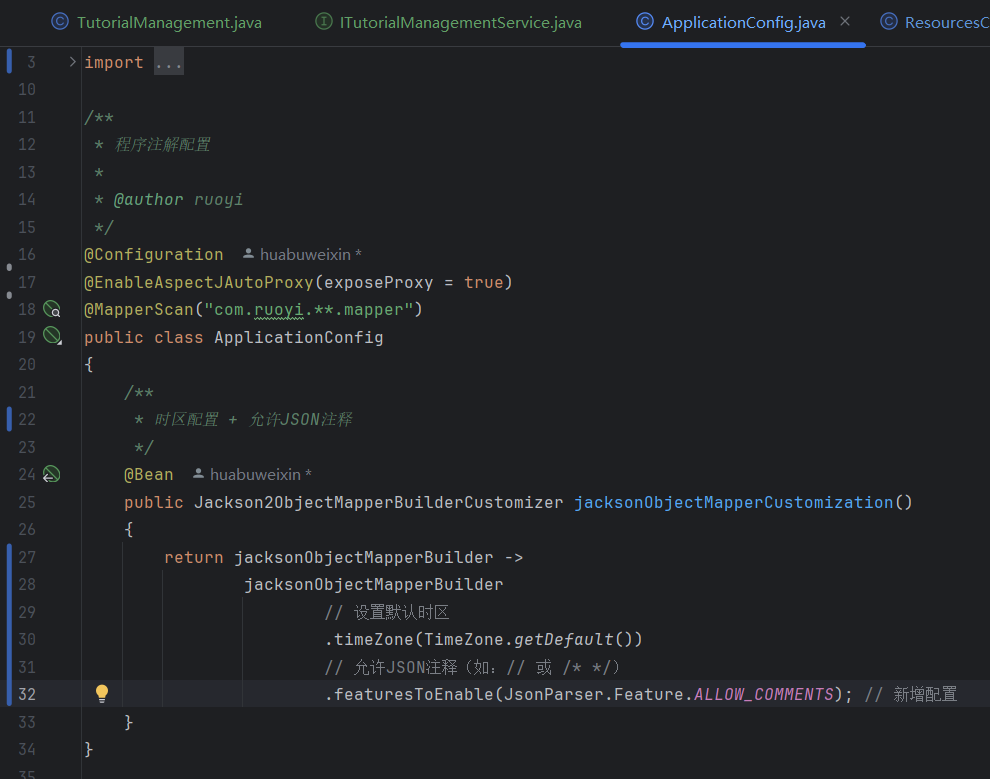

源码：
 /**
     * 时区配置
     */
    @Bean
    public Jackson2ObjectMapperBuilderCustomizer jacksonObjectMapperCustomization()
    {
        return jacksonObjectMapperBuilder -> jacksonObjectMapperBuilder.timeZone(TimeZone.getDefault());
    }

前端：

新增路由地址：

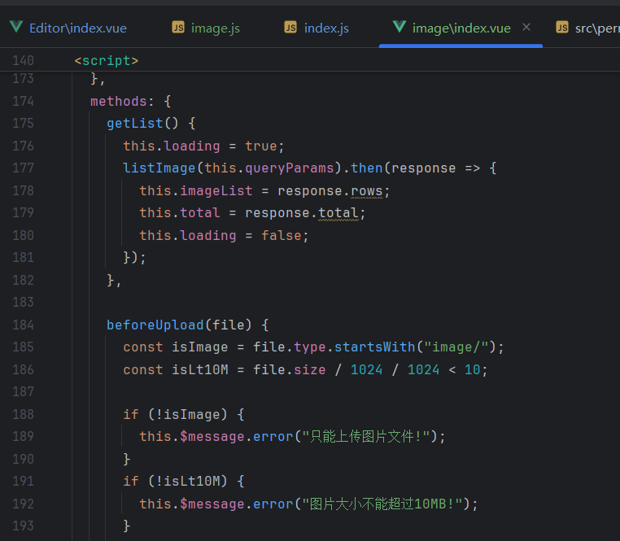