#### 教程管理功能完善

1.完善封面上传图片功能

vue代码：

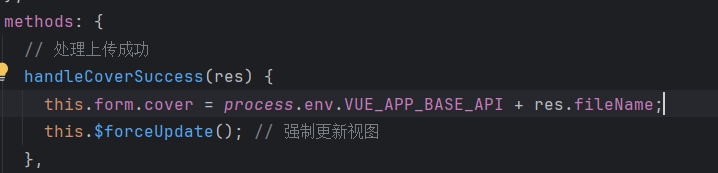

注意这里返回的是文件名称而不是文件的url。

2.添加上架与下架按钮

前端：
index.vue

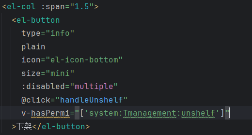

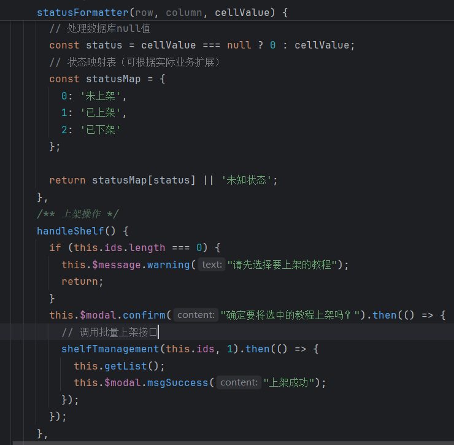

Tmanagement.js

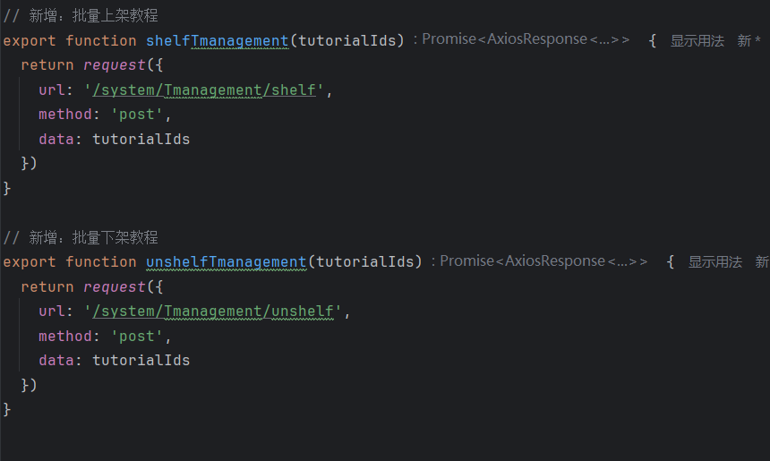

后端：
controller

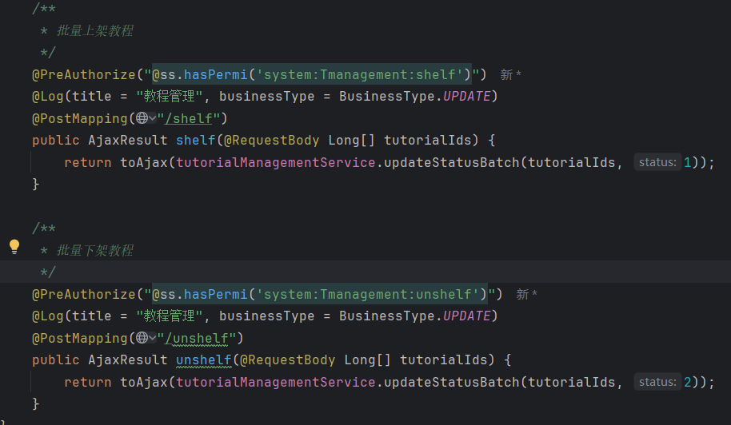

mapper

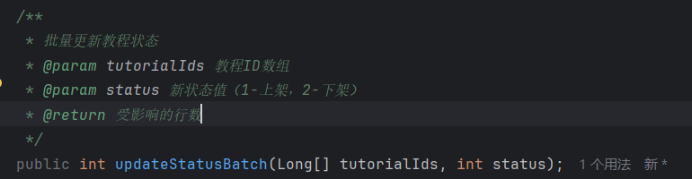

service

serviceImpl

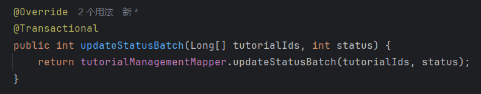

mapper.xml

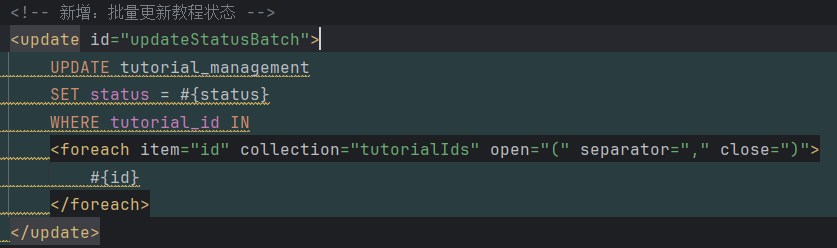

3.点击查看详情按钮实现跳转页面并预览内容功能

在前端新建一个vue用来显示新页面

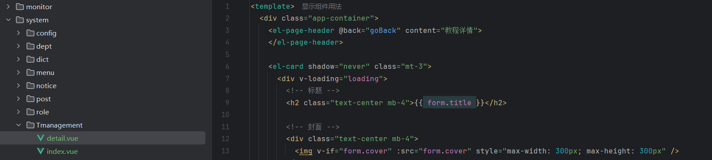

在路由文件中定义一个新路由用来指向新页面

在vue中定义跳转方法

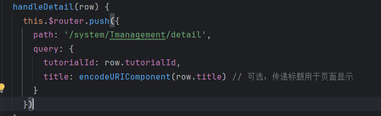

4.开发健身教程模块

若依模块开发：参考若依后台开发手册

[后台手册 | RuoYi](https://doc.ruoyi.vip/ruoyi/document/htsc.html#新建子模块)

​	在新增模块的后端编写数据库实现类的时候可能报错：无法自动装配。找不到 'TutorialFitnessMapper' 类型的 Bean。

​	需要在mapper类中添加注解：@Mapper // 确保添加此注解 public interface TutorialFitnessMapper extends BaseMapper<TutorialFitness> { ······    }

​	还遇到浏览器端报错找不到resource文件夹下mapper.xml文件的问题，解决方法就是将代码生成的文件mapper复制到resource文件夹下。这好像是一个bug，很容易找不到这个xml文件

5.健身教程子菜单——健身教程

​	先是调整页面布局和样式。这里不需要用到后端，所以只需要修改前端代码。

第一步：删除多余搜索框，只通过标题和教练搜索对应教程。

、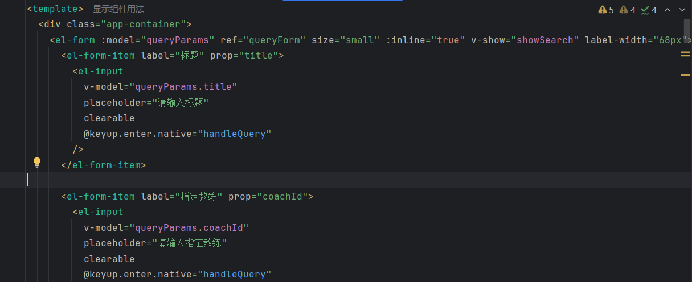

第二步：

修改教程列表的显示方式，删除操作列

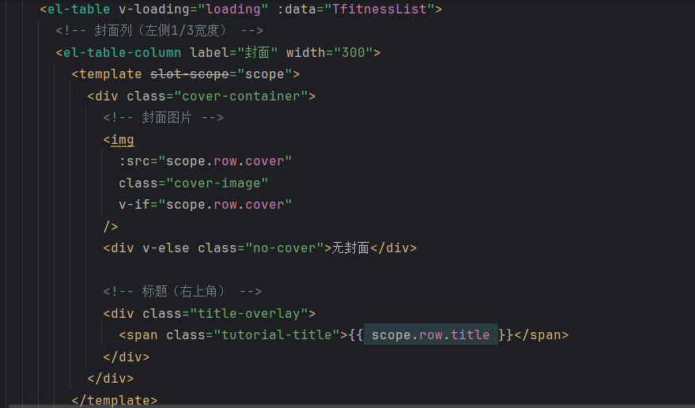

第三步：设置对应的style

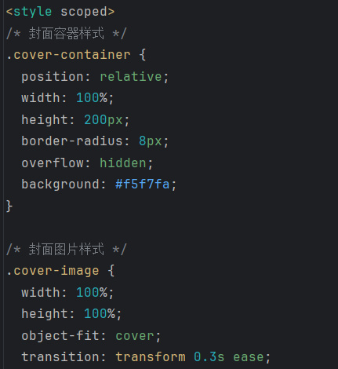

第四步：删掉无用代码如编辑器对话框等

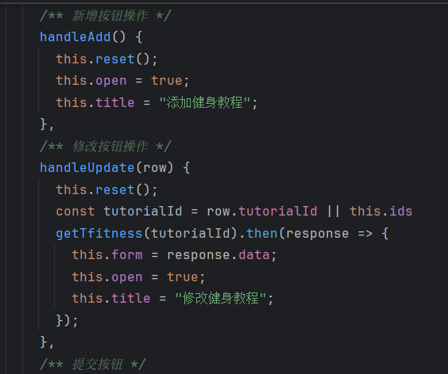

第五步：实现点击标题跳转详情页面的功能

​	由于之前按钮跳转的时候已经定义了路由和详情页的样式，这里直接统一接口即可。

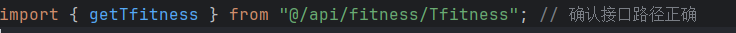

统一使用这个接口并添加了安全校验

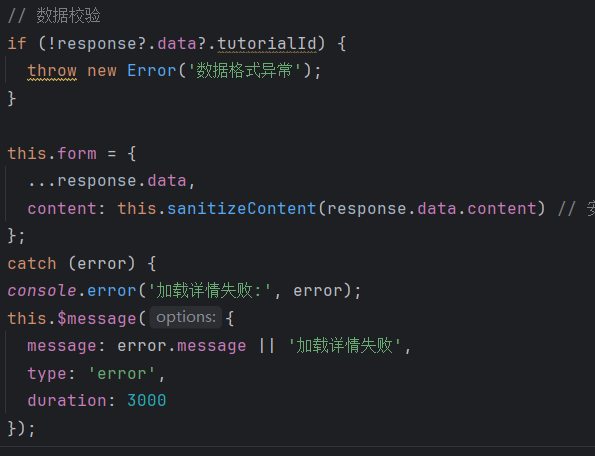

​	注意这里返回的是id，而不是之前的tutorialId。所以要修改之前教程管理页面那里的按钮跳转方法里的参数

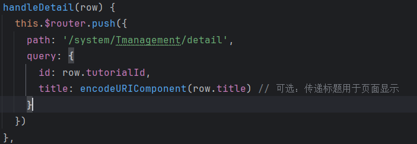

6.实现学员页面只显示已上架的教程

​	使用数据过滤的方式，后端对status字段的查询方式已经实现，所以最只需要在前端进行查询过滤即可。这里表示只查询status为1的教程并显示。

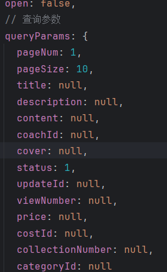

