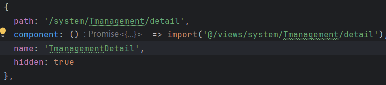

# 教练页面

1.隐藏路由样式。router/index.js



2.同步以后图片等文件找不到

​	查看数据库发现两个同样的封面

同步之前文件存储路径是：/dev-api/profile/upload/2025/04/24/image-20250409154611151_20250424143812A001.png

同步之后文件存储路径是：/profile/upload/2025/04/26/image-20250409154611151_20250426152802A002.png

所以只需要将/dev-api前缀删掉即可。

使用MySQL数据库的字符截取函数即可：
UPDATE your_table_name 

SET cover = SUBSTRING(cover, 9) 

WHERE cover LIKE '/dev-api%';

3.管理员端编辑器下拉框选择教练功能

涉及到多表联查。

思路：前端做一个下拉框组件，点击下拉框可以显示所有的教练名字，直接调用的是tutorial_management这个数据库表中的数据，对应的字段是coach_id，由于教练的姓名存储在另一个表sys_user中的user_name字段，并且这个sys_user表中存储的不光是教练的用户信息，还包括学员和管理员的信息。所以我需要从用户表中筛选出哪些是教练用户，并且返回教练的姓名。筛选条件就是根据每个用户的权限不同，对应的是role_id。但是这个role_id并不在表sys_user中，而是在另一个表sys_role中。这两个表之间的关系是多对对关系，因此还涉及关联表sys_user_role。这个关联表体现了每个用户user_id对应哪个权限role_id。然后根据这些信息联表查询筛选出教练的用户id，在前端显示教练的名称。不仅要查询出对应的教练id还要在下拉框选择的时候将教练id填入tutorial_management中的coach_id字段，前端显示的是教练的user_name。

实现步骤：

第一步：新建CoachVO.java（用于传输教练信息）

```
private Long userId;
private String userName;

public String getUserName() {
    return userName;
}

public void setUserName(String userName) {
    this.userName = userName;
}

public Long getUserId() {
    return userId;
}

public void setUserId(Long userId) {
    this.userId = userId;
}
```

第二步：Mapper接口（SysUserMapper.java）：

List<CoachVO> selectCoachList();

第三步：Mapper.xml（SysUserMapper.xml）：

```
<resultMap id="CoachVOResult" type="com.ruoyi.system.domain.vo.CoachVO">
    <result property="userId" column="user_id"/>
    <result property="userName" column="user_name"/>
</resultMap>

<select id="selectCoachList" resultMap="CoachVOResult">
    SELECT
    u.user_id,
    u.user_name
    FROM sys_user u
    JOIN sys_user_role ur ON u.user_id = ur.user_id
    JOIN sys_role r ON ur.role_id = r.role_id
    WHERE r.role_id = 2 
</select>
```

注意这里要符合若依框架代码规范。也就是新增resultMap和对应的select

第四步：Service接口（ISysUserService.java）：

List<CoachVO> selectCoachList();

第五步：Service实现（SysUserServiceImpl.java）：

@Override
public List<CoachVO> selectCoachList() {
    return sysUserMapper.selectCoachList();
}

第六步：Controller（SysUserController.java）：

@GetMapping("/coachList")
public AjaxResult coachList() {
    List<CoachVO> list = userService.selectCoachList();
    return AjaxResult.success(list);
}

第七步：Controller（SysUserController.java）：

@GetMapping("/coachList")
public AjaxResult coachList() {
    List<CoachVO> list = userService.selectCoachList();
    return AjaxResult.success(list);
}

第八步：

前端部分：

API（api/system/user.js）：

export function listCoaches() {
  return request({
    url: '/system/user/coachList',
    method: 'get'
  })
}

第九步： Vue组件：

<template>
  <el-form-item label="选择教练" prop="coachId">
    <el-select
      v-model="form.coachId"
      placeholder="请选择教练"
      clearable
      @change="handleCoachChange"
    >
      <el-option
        v-for="item in coachOptions"
        :key="item.userId"
        :label="item.userName"
        :value="item.userId"
      />
    </el-select>
  </el-form-item>
</template>

<script>
import { listCoaches } from "@/api/system/user";
export default {
  data() {
    return {
      coachOptions: [],
      form: {
        coachId: null
      }
    };
  },
  created() {
    this.getCoachList();
  },
  methods: {
    /** 获取教练列表 */
    getCoachList() {
      listCoaches().then(response => {
        this.coachOptions = response.data;
      });
    },
    handleCoachChange(val) {
      this.form.coachId = val;
    }
  }
};
</script>
第十步：列表显示优化：
由于目前教程列表直接调用的是数据库中的coach_id字段，所以现实的是一个id，需要将id映射成对应的教练姓名。

（1）在表格列中增加字段映射

<!-- 修改前 -->
<el-table-column label="教练" align="center" prop="coachId" />

<!-- 修改后 -->
<el-table-column label="教练" align="center" prop="coachName">
  <template slot-scope="scope">
    {{ findCoachName(scope.row.coachId) }}
  </template>
</el-table-column>

（2）添加教练姓名查找方法

methods: {
  // 新增方法：根据教练ID查找姓名
  findCoachName(coachId) {
    const coach = this.coachOptions.find(item => item.userId === coachId);
    return coach ? coach.userName : '未知教练';
  },

  // 修改后的getList方法
  getList() {
    this.loading = true;
    listTmanagement(this.queryParams).then(response => {
      this.TmanagementList = response.rows.map(item => ({
        ...item,
        // 添加映射字段
        coachName: this.findCoachName(item.coachId)
      }));
      this.total = response.total;
      this.loading = false;
    });
  }
}

（3）确保教练数据先加载

created() {
  // 调整加载顺序（先加载教练数据）
  this.getCoachList().then(() => {
    this.getList();
  });
},

4.搜索功能优化：将管理员端教练的文本搜索框改为下拉框选择搜索：

```javascript
<el-form-item label="教练" prop="coachId">
        <el-select
          v-model="queryParams.coachId"
          placeholder="请选择教练"
          clearable
          @keyup.enter.native="handleQuery" 
          style="width: 200px"
        >
          <el-option
            v-for="item in coachOptions"
            :key="item.userId"
            :label="item.userName"
            :value="item.userId"
          />
        </el-select>
      </el-form-item>
```

```javascript
/** 重置按钮操作 */
    resetQuery() {
      this.resetForm("queryForm");
      this.queryParams.coachId = null;  // 增加重置教练选择
      this.handleQuery();
    },
```

5.教练页面实现

​	新建一个新的vue页面然后复制管理员端的页面代码，然后去掉一些不需要的增删改查，只保留搜索和上架教程功能。

​	实现每个教练只能看到并操作自己的教程只需要在TmanagementController层进行一次后端过滤即可

```javascript
@PreAuthorize("@ss.hasPermi('system:Tmanagement:list')")
@GetMapping("/list")
public TableDataInfo list(TutorialManagement tutorialManagement) {
    // 获取当前登录用户
    LoginUser loginUser = SecurityUtils.getLoginUser();
    // 如果不是管理员角色，强制过滤教练ID
    if (!loginUser.getUser().isAdmin()) {
        tutorialManagement.setCoachId(loginUser.getUserId());
    }
    startPage();
    List<TutorialManagement> list = tutorialManagementService.selectTutorialManagementList(tutorialManagement);
    return getDataTable(list);
}
```

6.教练只有上架权限

首先将上架和下架的权限插入sys_menu表中

-- 插入上架权限按钮（需确认当前父菜单下最大的order_num值）
INSERT INTO sys_menu (menu_name, parent_id, order_num, path, component, is_frame, is_cache, menu_type, visible, status, perms, icon, create_by, create_time, update_by, update_time, remark)
VALUES('教程上架', 2014, 6,  '', '', 1, 0, 'F', '0', '0', 'system:Tmanagement:shelf', '#', 'admin', sysdate(), '', null, '');

-- 插入下架权限按钮
INSERT INTO sys_menu (menu_name, parent_id, order_num, path, component, is_frame, is_cache, menu_type, visible, status, perms, icon, create_by, create_time, update_by, update_time, remark)
VALUES('教程下架', 2014, 7,  '', '', 1, 0, 'F', '0', '0', 'system:Tmanagement:unshelf', '#', 'admin', sysdate(), '', null, '');

然后通过管理员将权限分配给教练这个角色。


