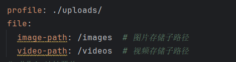
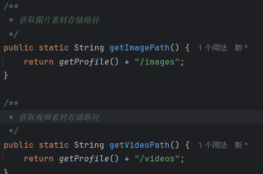
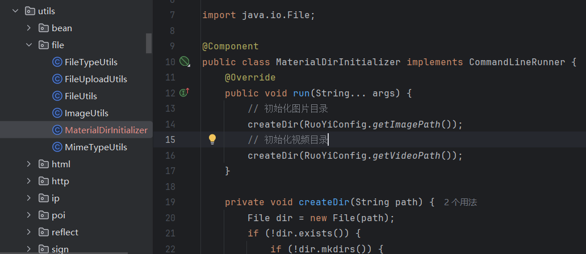
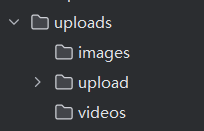
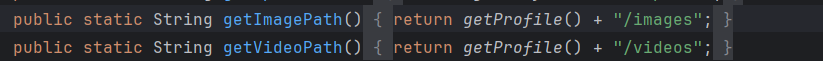
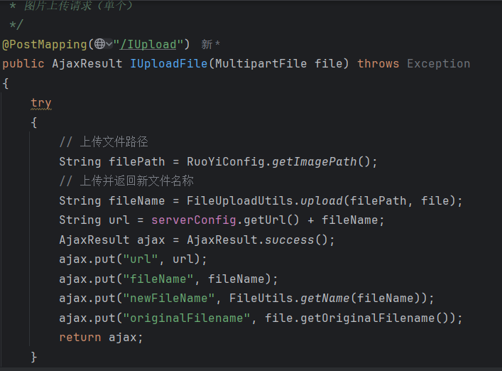
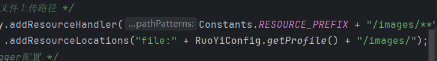
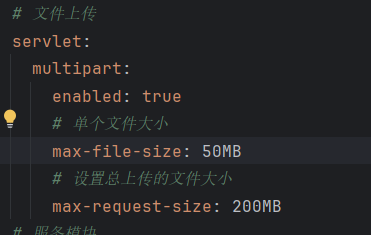
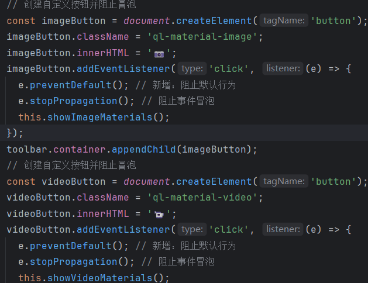
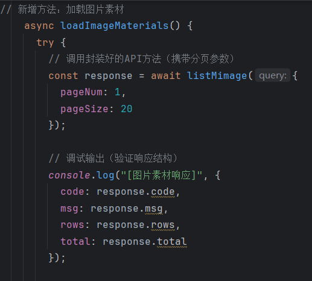

#####  素材库功能开发

1.在之前的文件上传目录下新建两个子目录分别存储图片素材和视频素材

第一步：修改application.yml

第二步：修改配置类（RuoYiConfig.java）新增两个获取存储路径的方法

第三步：新建一个java类用来目录初始化配置（保证启动时创建基础目录）

第四步：重新运行后端，检查是否已经创建了子目录

2.在ruoyiconfig类中定义两个新的方法用来将图片和视频分别放进不同的目录。

commoncontroller

最后还要在ResourcesConfig中配置静态资源映射

3.上传视频时浏览器端请求超时，原因是若依后台限制单个文件上传大小最多为10MB，将其修改即可。

4.图片的上传参考之前的封面上传功能即可。视频上传参考图片上传。通过不同的接口来将文件存到不同的目录中去。

5.修改富文本编辑器组件以调用素材库的素材

核心代码：

