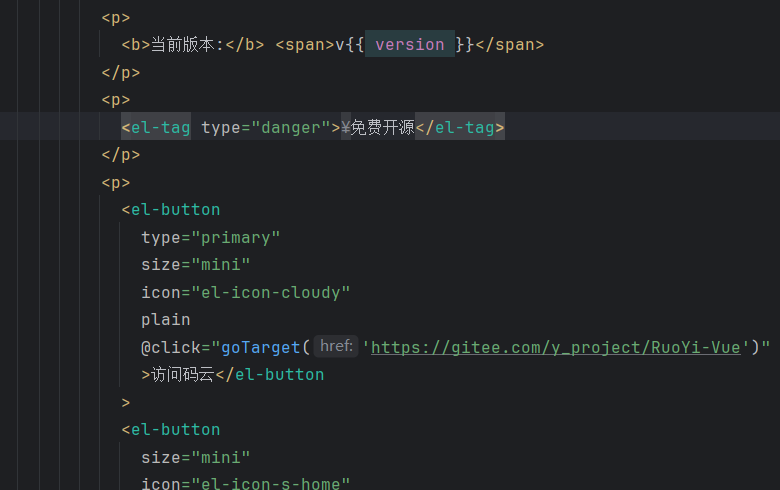
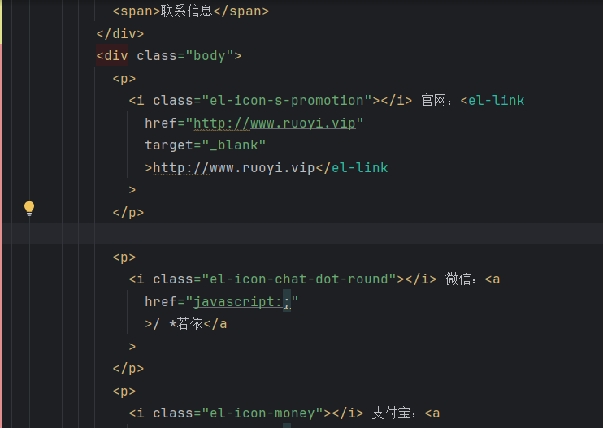
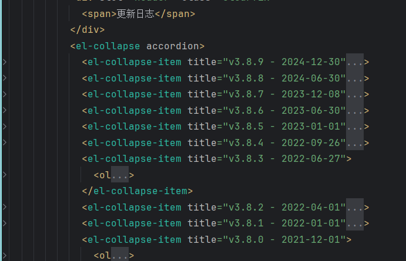
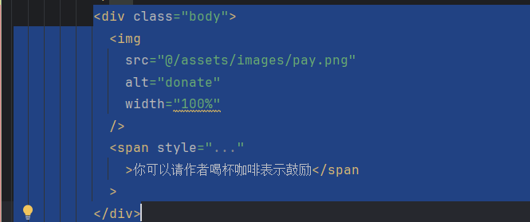
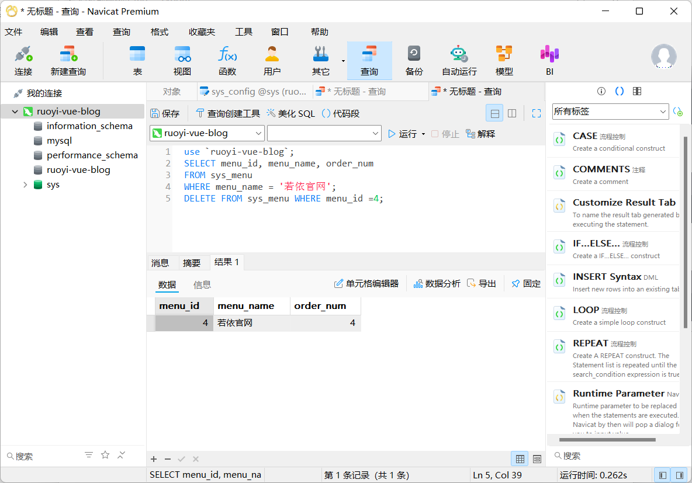
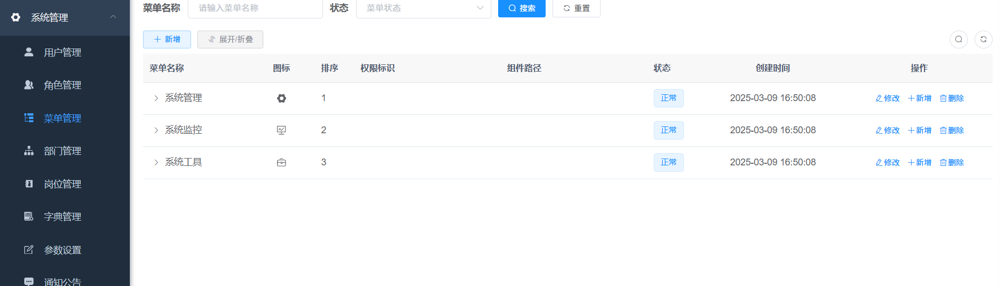
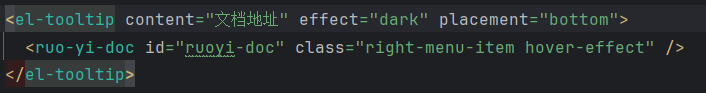
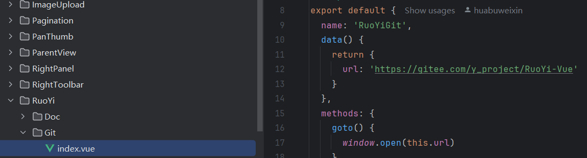
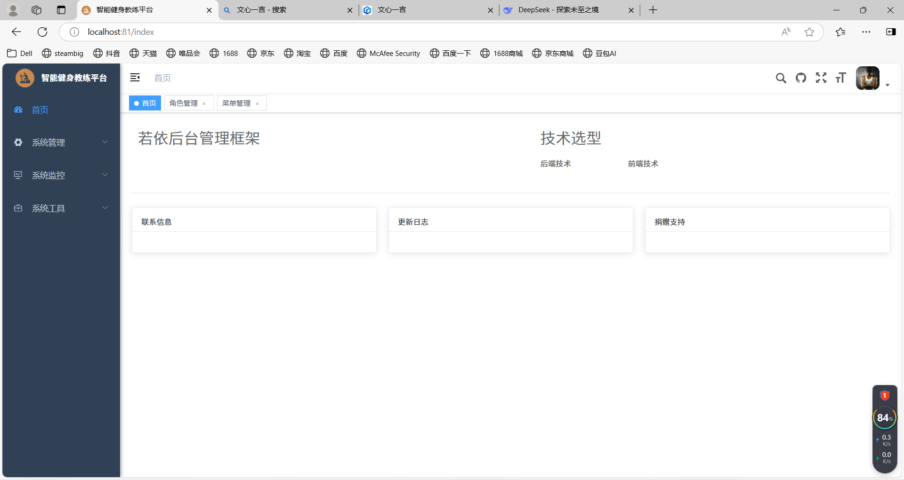

# 1.启动项目

启动redis：进入cmd，输入redis-server回车

启动MySQL:右键cmd以管理员身份运行，输入net start MySQL80回车

打开Navicat连接数据库

打开IDEA，启动后端，然后在前端的终端输入npm run dev启动前端。

# 2.修改的内容

## 删除首页文本、日志、二维码、链接

修改文件所在位置：ruoyi-ui/src/views/index.vue

源代码截图：

# 删除导航栏若依官网菜单

修改文件所在位置：MySQL

修改结果：

# 修改首页默认头像

修改文件所在位置：ruoyi-ui/src/store/modules/user.js

源代码截图：

# 删除文档地址

修改文件所在位置：ruoyi-ui/src/layout/components/Navbar.vue

源代码截图：

# 修改源码地址

修改文件所在位置：ruoyi-ui/src/components/RuoYi/Git

源代码截图：

整体修改效果：
