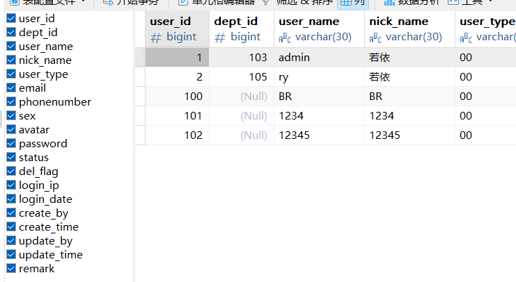
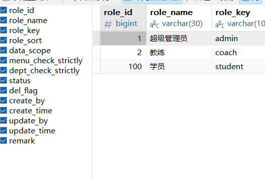
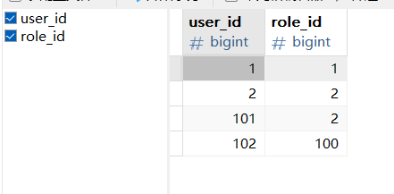
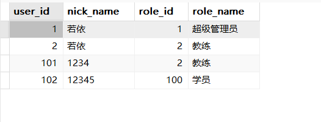

### 角色配置

##### 一、修改角色与增加角色配置

启动项目后通过超级管理员登录进入至角色管理页面中进行修改。


添加学员角色：


此时数据库中三个表状态，sys_user、sys_role、sys_user_role







角色信息与角色权限信息通过中间表相关。建立视图查询为：



修改registerUser方法，确保注册用户时usertype与role_id相对应。

```
 public boolean registerUser(SysUser user)
    {
        System.out.println(user);
        System.out.println(user.getUserType());
        if (user.getUserType().equals("11")){//usertype
            System.out.println("学员");
            Boolean total = userMapper.insertUser(user) > 0;
            insertUserRole(userMapper.selectUserByUserName(user.getUserName()).getUserId(),new Long[]{100L});//插入role_id
            return total;
//        return userMapper.insertUser(user) > 0;
        }else {
            System.out.println("教练");
            Boolean total = userMapper.insertUser(user) > 0;
            insertUserRole(userMapper.selectUserByUserName(user.getUserName()).getUserId(),new Long[]{2L});
            return total;
        }

    }
```

实现效果：


#### 

